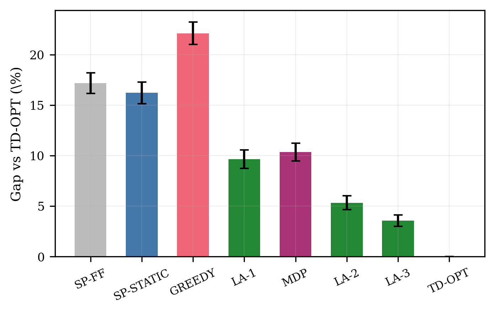

# Signal-Aware Routing

Companion code for the paper:

> **Routing Through Traffic Signals: The Value, Depth, and Accuracy of Phase Information**
> Junbo Jacob Lian, working paper, 2026.

Navigation systems route with traffic signals summarized as static average turn
penalties; real-time phase information is used only for display and speed advisory.
This repository contains the full simulation and analysis suite behind the paper,
which treats route choice itself as a function of signal-phase information and
quantifies what each layer of information is worth.

## Key findings

1. **Speed separates from routing.** Under a speed cap with waiting permitted,
   cruising at the cap and waiting at stoplines is time-optimal on every route,
   so speed advisory (GLOSA) never changes arrival time and route choice can be
   optimized with constant link times.
2. **Take-the-green is a trap.** The myopic rule that always follows the current
   green has worst-case ratio Theta(C/tau_min) and, on average, beats static
   routing only when link times are nearly homogeneous (coefficient of variation
   below about 13% in the base grid). Its advantage decays at the policy-free
   rate of one third of a second per second of link-time dispersion per decision;
   the full-grid simulated slope matches this prediction within 4%.
3. **Timing accuracy has a linear price.** Planning with offsets known to within
   sigma degrades linearly; benefits break even with static routing near a
   quarter cycle. Production countdown accuracy (a few seconds) sits deep inside
   the useful region.
4. **Depth has geometric returns, capped by accuracy.** Rolling lookahead over k
   true crossings closes the optimality gap by a factor of about 0.6 per crossing,
   with a floor set by countdown error.
5. **Under unknown offsets the optimum is a threshold rule.** The optimal
   non-revisiting policy is link-stationary, often collapsing to a single number
   per link ("turn right if the straight countdown exceeds b"). Its value shows
   the light directly ahead is worth only about a third of the full-information
   gap; the rest requires downstream timing data.
6. **Congestion is the boundary.** In SUMO under congestion with queue-ignorant
   planners, deep timing plans lose their entire advantage while the shallow
   one-step rule beats static routing in 39 of 40 paired instances at moderate
   demand, an edge that persists from light to heavy demand (n = 40 at the
   moderate level, ten background seeds; three demand levels).

## Repository layout

```
signal_routing.py      Core model: grid network, four-phase signals, RTOR,
                       movement-expanded time-dependent Dijkstra (TD-OPT),
                       SP-FF / SP-STATIC / GREEDY baselines, scenario suite.
lookahead.py           Rolling LA-k policies and the static value function.
extend_lookahead.py    LA-k for k = 1..5 under countdown error sigma = 0/5/10 s.
sweep_hetero.py        Greedy-vs-static advantage across link heterogeneity.
ladder_verify.py       Monte Carlo check of the closed-form ladder model (Prop 3).
check_uniform.py       Uniform-arrival-phase sanity check (Lemma 3).
mdp_policy.py          Unknown-offset MDP: value iteration, threshold policy,
                       simulation validation (Prop 6).
sumo_runner.py         SUMO microscopic experiments (empty and congested).
sumo_aggregate.py      Paired statistics and tables from SUMO outputs.
make_figures.py        Regenerates all five paper figures into figures/.
raw_results.csv        Per-instance results of the grid study.
summary.csv            Aggregated grid-study results.
sumo_results/          Raw SUMO run outputs (json).
figures/               Paper figures (regenerable).
```

## Installation

Python 3.10 or later.

```bash
pip install -r requirements.txt
```

The core model and all analytical experiments use the standard library only;
`matplotlib` is needed for figures. The SUMO experiments additionally require:

```bash
pip install eclipse-sumo sumolib traci
```

## Reproducing the paper

| Paper artifact | Command | Approximate runtime |
|---|---|---|
| Tables 1-2, `raw_results.csv` | `python signal_routing.py` | minutes |
| Table 3 (LA-k x sigma) | `python extend_lookahead.py` | ~5 min |
| Prop 3 closed form vs Monte Carlo | `python ladder_verify.py` | ~1 min |
| Prop 6 MDP value and policy | `python mdp_policy.py` | ~2 min |
| Lemma 3 sanity check | `python check_uniform.py` | seconds |
| SUMO validation and congestion | `python sumo_runner.py empty`, `python sumo_runner.py mod METHOD SEED`, `python sumo_runner.py dem METHOD SEED DENOM`, then `python sumo_aggregate.py` | ~1 min per chunk |
| All figures | `python make_figures.py` | ~2 min |

Model defaults: 8x8 grid, cycle C = 120 s, symmetric splits (40 s through, 20 s
protected left), through-before-left, right turn on red enabled, crossing time
2 s, link times U[40, 90] s, i.i.d. uniform offsets, corner-to-corner trips,
paired evaluation across 60 networks x 8 departures with 95% confidence
intervals. All scenario ablations (RTOR off, reversed phase order, synchronized
and progressive offsets, grid sizes 5 and 12) are switches inside
`signal_routing.py`.

## Results snapshot

Gap to the full-information optimum (TD-OPT), base grid, paired instances:

| Method | Gap |
|---|---|
| GREEDY (take the green) | 22.1% |
| SP-FF (ignore signals) | 17.2% |
| SP-STATIC (expected delays) | 16.2% |
| LA-1 (one crossing of truth) | 9.7% |
| MDP optimum, unknown offsets | 10.4% |
| LA-3 | 3.6% |
| TD-OPT | 0 |



## License

MIT. See `LICENSE`.

## Citation

```bibtex
@unpublished{lian2026signals,
  author = {Lian, Junbo Jacob},
  title  = {Routing Through Traffic Signals: The Value, Depth, and Accuracy of Phase Information},
  note   = {Working paper},
  year   = {2026}
}
```
